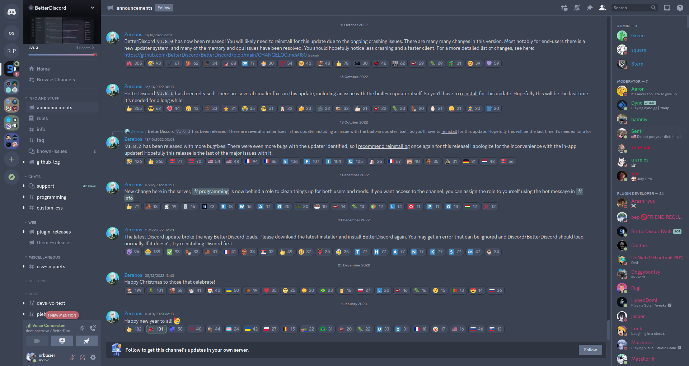
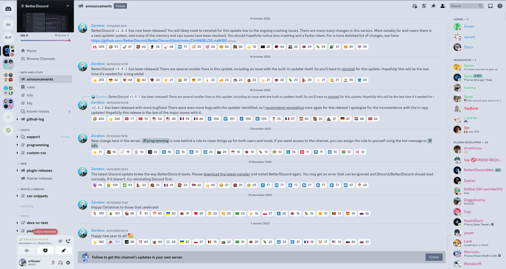

# Discord nordic theme (uniform variant)

This theme change all discord style for follow [Nord palette](https://www.nordtheme.com/).

## Preview

|               Dark                |                     Light                     |
| :-------------------------------: | :-------------------------------------------: |
|  |  |

## Installation

### BetterDiscord

1. Download [Nordic theme](https://raw.githubusercontent.com/orblazer/discord-nordic/master/uniform/nordic.theme.css)
2. Put it on theme folder (from **[BetterDiscord](https://github.com/rauenzi/BetterDiscordApp)**)
3. Enable it !
4. Donate if you could <3

### UserCSS (Stylus)

1. Install `Stylus` (is is not already)
2. Go to [Nordic theme](https://raw.githubusercontent.com/orblazer/discord-nordic/master/uniform/nordic.user.css)
3. Click on `Install Style` (keep checked `check for updates`)
4. Donate if you could <3

### Vencord

1. Install `Vencord Web` extension (is is not already)
2. Copy this link `https://raw.githubusercontent.com/orblazer/discord-nordic/master/uniform/nordic.vencord.css`
3. Past it on theme list in **Vencord** theme settings
4. Donate if you could <3

## Customize (BetterDiscord)

If you want customize the theme can simply edit CSS variables in theme file.
